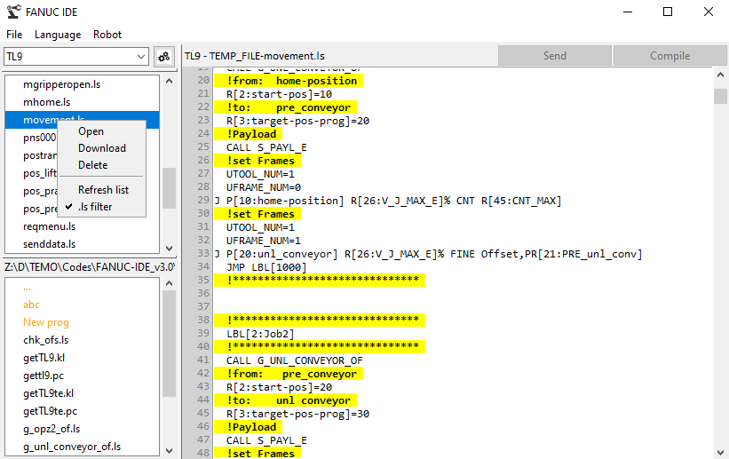

# FANUC LS and KL Program Editor



A program for viewing, downloading, editing and sending LS (TP) files of FANUC robots, as well as for compilation.kl files.

## Features

- Line numbers
- Multi-language support (English/Russian)
- When ls file opened, hides: heading information, numbering in the text, semicolons, points information
- Uploading and sending files via **FTP**. Same with a real robot
- Saving a list of servers (robots)
- Compiling **KAREL** files
- Highlighting comments in ls file viewing mode
- The ability to view the program without saving it to disk

# ROBOT INFORMATION

To compile the files, information about the robot from <ins>ROGOBUIDE</ins> **v9.10** model **R-2000iC 210F** is used. If you need to replace the virtual robot, then take the Robot_1 folder from the roboguide project and replace it in the resources folder.

## Installation

1. Clone repository:
```bash
git clone https://github.com/da-ya08/FANUC-IDE.git
cd fanuc-ide
```

2. Install dependencies:
```bash
pip install -r requirements.txt
```

3. Run:
```bash
python main.py
```

## Robot settings

- You need to set up an **FTP** password on the robot (*or, as in my case, remove FTP authorization*)
- Have an ethernet connection to the robot
- Use this data in this application

## Get .exe

You can also [download .exe](https://github.com/da-ya08/FANUC-IDE/releases).

## Usage

Download LS files from the robot, edit them and send them back. Create KL programs, compile and send them ready.pc file.

## Use FTP

- Click on the settings button next to the server drop-down menu
- Enter the data for the server (if there is no password, leave the login and password fields empty)
- Click on "Connection Test" to check the connection
- Click "Add" to save the server from the list
- Close the window and select the server in the drop-down list, the LS files will be displayed.
- Double-click to download and open the file

## Compile kl files

- Open the kl file and click "Compile"
- The program will display the compilation result
- When you click the "Send" button, the created one will go .pc file

## Contributing

Pull requests are welcome! For major changes, please open an issue first.

## In the future
It is planned to add a title and point information generator, also make also add the ability to create backup

## License
This project is licensed under the MIT License - see the [LICENSE](LICENSE) file for details.