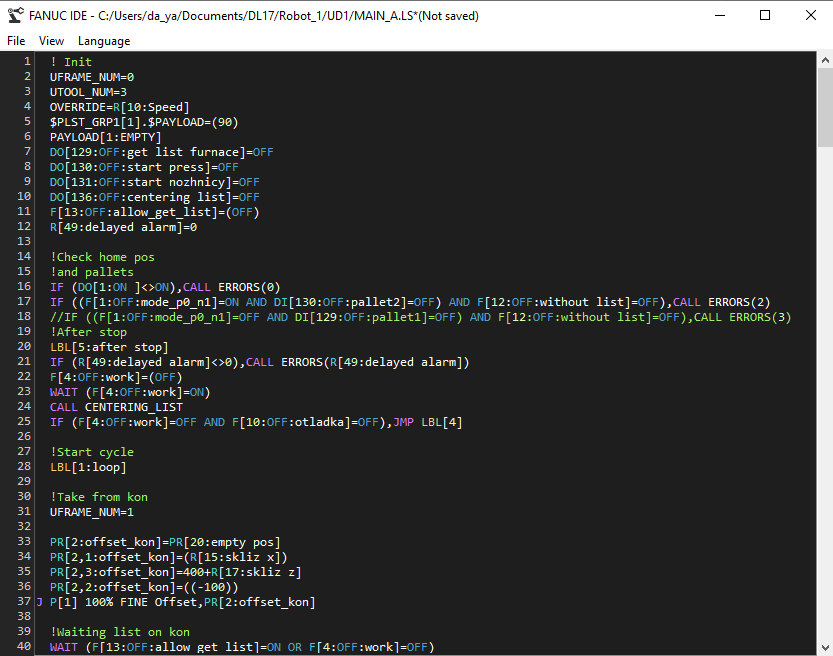

# FANUC LS Program Editor



Cross-platform IDE for FANUC robot programming (LS files) with syntax highlighting.

## Features

- Syntax highlighting for FANUC LS programs
- Line numbers
- Dark/Light themes
- Multi-language support (English/Russian)
- Ability to drag a .LS file onto a packed script in exe to open it

## Installation

1. Clone repository:
```bash
git clone https://github.com/yourname/fanuc-ide.git
cd fanuc-ide
```

2. Install dependencies:
```bash
pip install -r requirements.txt
```

3. Run:
```bash
python src/main.py
```

## Usage

Open LS files, edit syntax highlighting and save.

## Contributing

Pull requests are welcome! For major changes, please open an issue first.

## In the future
It is planned to add a title and point information generator.

## License
This project is licensed under the MIT License - see the [LICENSE](LICENSE) file for details.